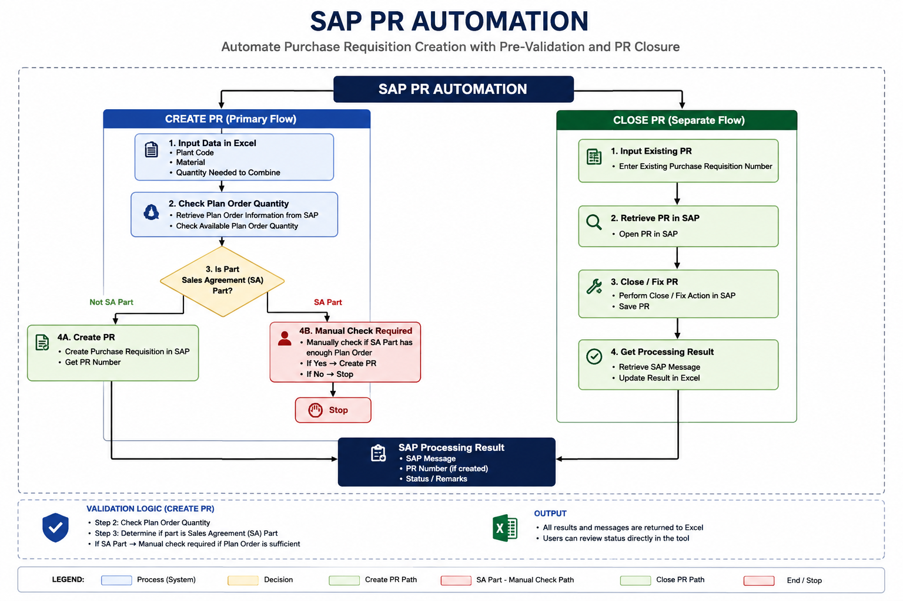
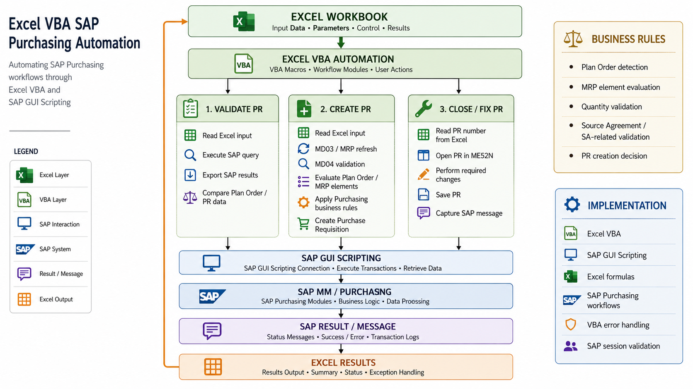

# SAP Purchase Requisition Automation

Excel VBA and SAP GUI Scripting automation for SAP Purchasing workflows, focused on Purchase Requisition creation, Plan Order validation, and PR Close/Fix activities.

## Overview

This project automates repetitive SAP Purchasing activities through an Excel-based workflow. Excel provides the user interface and input data, while VBA controls the automation and SAP GUI Scripting performs the SAP interactions.

The project contains three functional workflows:

* Plan Order / Sales Agreement validation
* Purchase Requisition creation
* Purchase Requisition Close/Fix

Purchase Requisition creation is the primary workflow. The validation process supports the creation decision, while Close/Fix is a separate workflow for existing PRs.

## Business Problem

The Purchasing process required repeated navigation between Excel and SAP to review material requirements, check Plan Order information, create Purchase Requisitions, and process existing PRs.

The automation was developed to reduce repetitive navigation and data entry while providing a more consistent workflow for Purchasing users.

## Solution

The automation reads input data from Excel, performs the required business-rule checks, interacts with SAP through GUI Scripting, and writes SAP results back to Excel.

The PR creation workflow includes:

1. Read material and quantity information from Excel.
2. Refresh MRP information using `MD03`.
3. Review MRP information through `MD04`.
4. Evaluate relevant MRP elements, including Plan Orders and scheduling lines.
5. Apply quantity and Purchasing business rules.
6. Create the Purchase Requisition when the required conditions are met.
7. Return the SAP processing result to Excel.

The validation workflow uses `SQ00` to obtain Plan Order information and combines SAP results with Excel-based calculations for comparison.

The Close/Fix workflow uses `ME52N` to process existing Purchase Requisitions and return the SAP result to Excel.

## Workflow

## Architecture

The architecture consists of an Excel workbook, separate VBA workflows, SAP GUI Scripting, and SAP Purchasing processes. SAP messages and processing results are returned to Excel.

## Technologies

* Microsoft Excel
* Excel VBA
* SAP GUI Scripting
* SAP MM / Purchasing
* Excel formulas and data processing

## Key Features

* Purchase Requisition creation
* Plan Order quantity validation
* Sales Agreement part identification
* MRP element evaluation
* SAP GUI automation
* PR Close/Fix processing
* Excel-based input and result tracking
* SAP message handling
* VBA error handling
* SAP session validation

## Results

The automation provides a repeatable Excel-to-SAP workflow for Purchasing activities and reduces repetitive manual SAP navigation and data entry.

No formal time-saving or productivity percentage has been measured, so no performance metric is claimed.

## My Role

I developed and maintained the automation based on my SAP Purchasing process knowledge. This included translating Purchasing business rules into VBA logic, implementing SAP GUI interactions, handling SAP results, and integrating the workflows with Excel.

## Limitations

* The automation depends on SAP GUI Scripting and SAP screen/control identifiers.
* SAP screen or layout changes may require maintenance.
* The solution is designed around the existing SAP Purchasing workflow and is not a general-purpose automation framework.
* The Plan Order / Sales Agreement validation workflow requires compatibility adjustment following a SAP upgrade.
* Automated testing and structured logging are not currently implemented.

## Future Improvements

Potential improvements include:

* Extracting shared SAP session handling into reusable procedures.
* Moving configurable values out of VBA code.
* Adding structured execution logging.
* Adding automated testing where practical.
* Improving resilience against SAP GUI layout changes.

## Disclaimer

This repository contains a sanitized portfolio version of an enterprise automation project. Company-specific information, internal identifiers, and production data have been replaced or removed. The public version is intended to demonstrate the automation approach and technical implementation without exposing confidential information.
