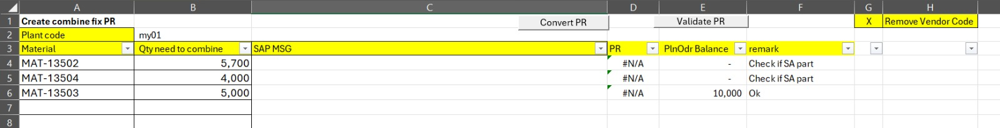
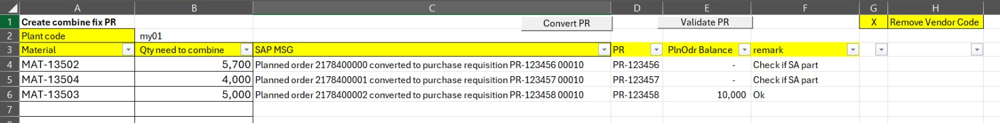
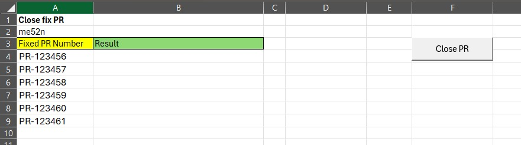
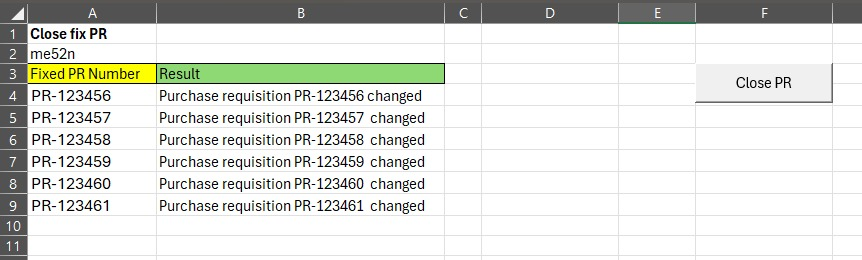

# SAP Purchase Requisition Automation

> Production SAP GUI automation developed to streamline Purchase Requisition (PR) creation for the Purchasing team, with pre-creation Plan Order and Sales Agreement checks and a separate PR closure workflow.

---

## Project Summary

This project automates Purchase Requisition (PR) creation for the Purchasing team using Microsoft Excel VBA and SAP GUI Scripting.

Before creating a PR, the automation checks the available Plan Order quantity and determines whether the part is a Sales Agreement (SA) part.

For SA parts, an additional manual check is required to confirm that sufficient Plan Order quantity is available before the PR is created.

The tool also includes a separate workflow for closing or fixing existing Purchase Requisitions.

**Project Status:** Production

---

## Business Problem

Before this automation was introduced, buyers manually performed several checks and SAP activities before creating Purchase Requisitions.

The process required users to:

- Check available Plan Order quantity.
- Determine whether the part is a Sales Agreement (SA) part.
- Perform an additional Plan Order quantity check for SA parts.
- Create the Purchase Requisition in SAP.
- Separately process existing Purchase Requisitions that needed to be closed or fixed.

These activities involved repetitive SAP navigation, manual checking, and data entry.

---

## Solution

The automation streamlines the Purchase Requisition process by:

- Checking Plan Order quantity before PR creation.
- Identifying whether the part is a Sales Agreement (SA) part.
- Proceeding with PR creation for non-SA parts.
- Requiring a manual Plan Order sufficiency check for SA parts.
- Stopping the PR creation process when the required condition is not met.
- Creating the Purchase Requisition through SAP GUI Scripting.
- Returning SAP processing messages and PR information to Excel.
- Providing a separate workflow for closing or fixing existing Purchase Requisitions.

The automation was developed around the existing Purchasing workflow and SAP process.

---

## Core Features

### 1. Purchase Requisition Creation

The primary function of the automation is to create Purchase Requisitions in SAP.

The workflow:

1. Accepts the required information through Excel.
2. Checks the available Plan Order quantity.
3. Determines whether the part is a Sales Agreement (SA) part.
4. Proceeds with PR creation for non-SA parts.
5. Requires an additional manual Plan Order quantity check for SA parts.
6. Creates the Purchase Requisition when the required condition is satisfied.
7. Returns the SAP processing result to Excel.

### 2. Pre-Creation Validation

Before PR creation, the automation performs:

- Plan Order quantity checking.
- Sales Agreement (SA) validation.

The processing path differs depending on whether the part is an SA part.

### 3. Purchase Requisition Closure

The tool also provides a separate workflow for processing existing Purchase Requisitions that require closure or fix processing.

The user provides the existing PR information, the automation performs the SAP processing, and the result is returned to Excel.

---

## Technologies Used

| Category | Technology |
|----------|------------|
| Language | Excel VBA |
| ERP | SAP MM |
| Automation | SAP GUI Scripting |
| Office | Microsoft Excel |

---

## Workflow

The following diagram illustrates the PR creation workflow, including Plan Order and Sales Agreement checks, together with the separate PR closure workflow.

---

## Architecture

The current solution uses separate VBA modules for validation, PR creation, and PR closure.

---

## Screenshots

### Plan Order and SA Validation

The Excel interface displays the material, required quantity, Plan Order information, SAP processing information, and validation remarks used during the PR creation process.

### Purchase Requisition Creation Result

The automation returns SAP processing messages and the resulting Purchase Requisition information to Excel.

### Close PR

The separate workflow allows users to provide an existing Purchase Requisition for Close/Fix processing.

### Close PR Result

The SAP processing result is returned to Excel after the Close/Fix PR operation.

---

## Business Rules

The PR creation workflow follows the existing Purchasing process.

The main checks are:

- Check the available Plan Order quantity.
- Determine whether the part is a Sales Agreement (SA) part.
- For non-SA parts, proceed with PR creation.
- For SA parts, perform an additional manual check to confirm sufficient Plan Order quantity.
- Stop the PR creation process when the required condition is not satisfied.

---

## Business Impact

This automation helps the Purchasing team by:

- Reducing repetitive SAP navigation during PR processing.
- Reducing manual checks during the PR creation workflow.
- Standardizing the pre-creation checking process.
- Returning SAP processing information directly to Excel.
- Providing a repeatable workflow for PR creation.
- Supporting separate processing of existing PRs that require closure or fixing.

No percentage-based efficiency improvement is claimed because no formally measured time-saving data is currently available.

---

## My Role

I was responsible for:

- Understanding the Purchasing workflow and automation requirements.
- Designing the automation workflow.
- Developing the Excel VBA solution.
- Integrating the solution with SAP GUI Scripting.
- Implementing the pre-creation validation logic.
- Developing the PR creation workflow.
- Developing the Close/Fix PR workflow.
- Testing the automation.
- Maintaining and enhancing the solution after deployment.

---

## Current Limitations

- Requires SAP GUI.
- Requires SAP GUI Scripting to be enabled.
- Requires appropriate SAP user authorization.
- The current implementation is based on Excel VBA.
- The automation is designed around the specific internal Purchasing workflow.
- SA parts require a manual Plan Order sufficiency check before PR creation.

---

## Lessons Learned

Developing this project reinforced several automation principles:

- Business conditions should be checked before executing SAP transactions.
- Validation should happen before PR creation.
- SAP GUI automation requires careful handling of transaction states and processing results.
- Understanding the Purchasing process is important when translating manual activities into automation.
- Separating different SAP activities into dedicated VBA modules makes the solution easier to maintain.

---

## Roadmap

### Planned Version 2

If this workflow is migrated to Python, planned improvements include:

- Migrate the automation from VBA to Python.
- Use pandas for data validation and processing.
- Separate SAP operations into reusable modules.
- Introduce centralized logging.
- Improve exception handling.
- Move configuration values into external configuration files.
- Support parallel SAP sessions where appropriate.
- Improve maintainability and reusability.

### Long-Term Direction

The longer-term direction is to reuse the automation concepts developed in this project as part of a broader Purchasing Automation Center.

The Purchasing Automation Center is currently a planned concept and is not part of this production implementation.

---

## Engineering Skills Demonstrated

- SAP GUI Scripting
- Excel VBA Development
- SAP MM Process Knowledge
- Business Process Automation
- Business Rule Validation
- Excel-based Data Processing
- SAP Transaction Automation
- Workflow Automation
- Production Automation Support
- Troubleshooting and Maintenance

---

## Project Information

| Item | Details |
|------|---------|
| Project Status | Production |
| Project Type | Internal SAP Automation |
| Primary Function | Purchase Requisition Creation |
| Pre-Creation Checks | Plan Order Quantity and SA Part |
| Secondary Function | Purchase Requisition Closure/Fix |
| ERP System | SAP MM |
| Programming Language | Excel VBA |
| Automation Method | SAP GUI Scripting |
| Primary Users | Purchasing Team |
